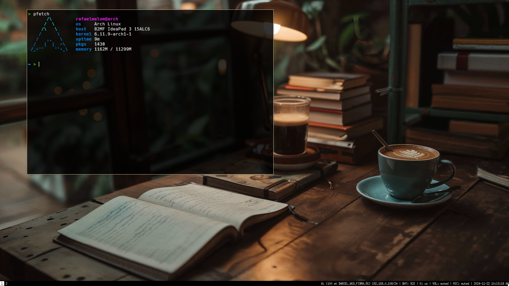

# **.dotfiles** 

Simple and light config for windows managers i3 and sway (i3-like for wayland)

---

### I3 preview 

i3 workflow dependencies:
- i3 
- dunst 
- rofi 
- feh 
- picom 
- i3lock-color (i3lock fork)
- maim

---

### SWAY preview 

sway workflow dependencies:
- sway
- mako (config actually using swaync)
- grim, slurp, swappy

--- 

Both setups are using kitty as terminal emulator.

Thanks for all!

