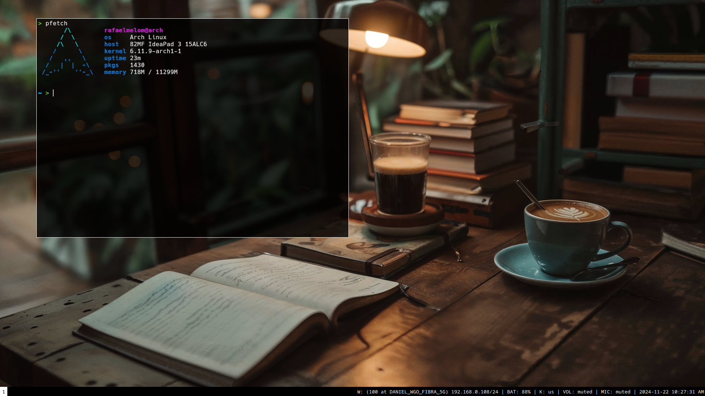

# **.dotfiles** 

Simple and light config for window manager sway (i3-like for wayland)

---

### SWAY preview 

sway workflow dependencies:
- sway
- mako (config actually using swaync)
- grim, slurp, swappy

--- 

This setup has using ghostty as terminal emulator.

Thanks for all!

